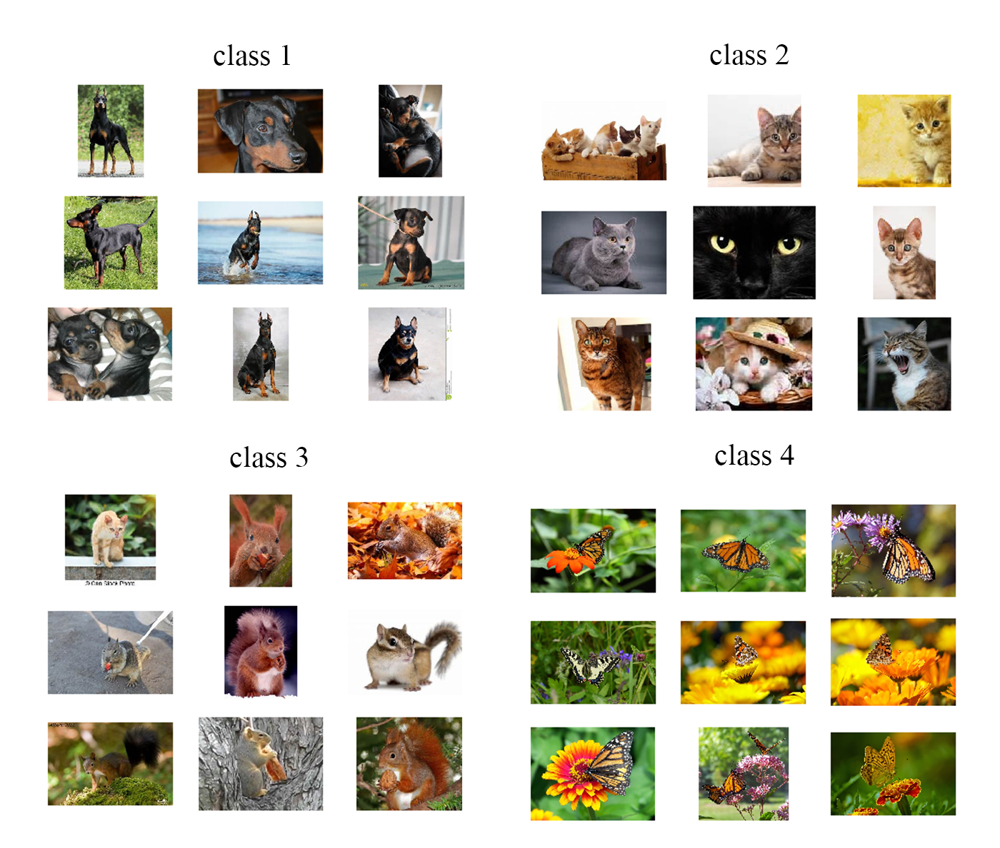
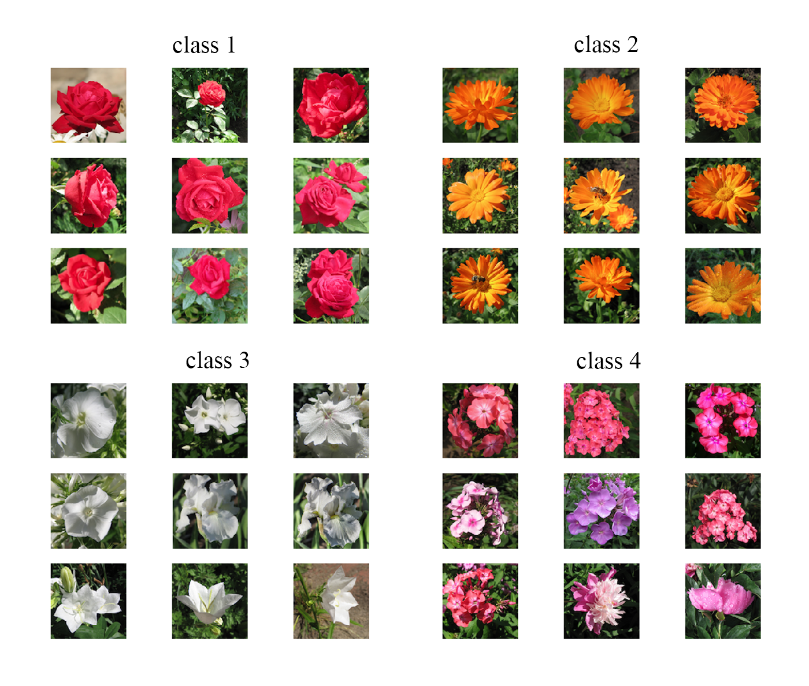

# Image Clustering

## Installation

```bash
pip install -r requirements.txt
```

- torch
- img2vec
- numpy
- scikit-learn
- matplotlib

## Demo




## Usage

```bash
usage: main.py [-h] [-i INPUT] [-c CLUSTER] [-p PCA]

Image caption CLI

optional arguments:
  -h, --help                        show this help message and exit
  -i INPUT, --input INPUT           Input directoryt path, such as ./images
  -c CLUSTER, --cluster CLUSTER     How many cluster will be
  -p PCA, --pca PCA                 PCA Dimensions
```

### Example

```bash
python main.py -i "D:\New folder\random_1500" -c 50 -p 16 
```

## Contributing

Pull requests are welcome. For major changes, please open an issue first
to discuss what you would like to change.

Please make sure to update tests as appropriate.

## License

[MIT](https://choosealicense.com/licenses/mit/)
